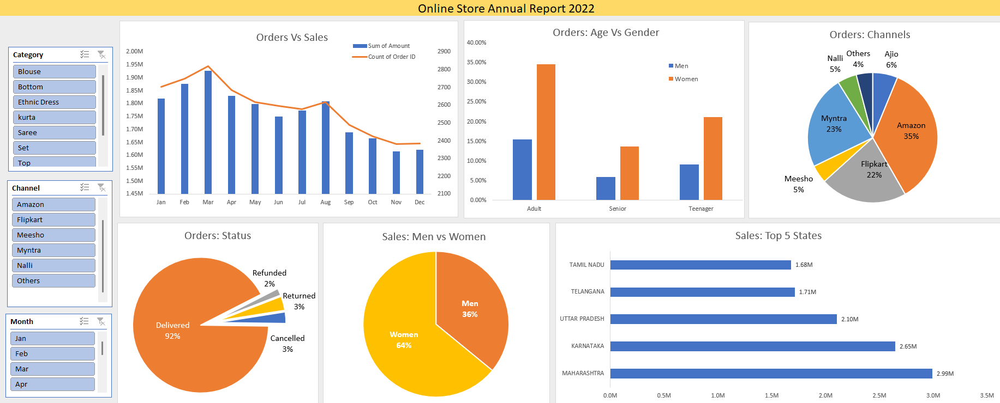

# Online-Store-Data-Analysis
This repository contains code and resources for conducting analysis of an online store data. The purpose of this project is to explore, analyse, and derive insights from a dataset related to online store orders. The analysis encompasses various aspects &amp; factors influencing various orders.

## Project Overview

**Online store wants to create an annual sales report for 2022. So that, owners can understand their customers and grow more sales in 2023**

###  Data Sources

Online Store Data: The primary dataset used for this analysis is the "online_store_data_analysis.xlsx" file, containing detailed information about orders.

  - This spreadsheet contains 2 sheets & 6 pivot table sheets:
    - Store Report 2022: main dashboard contains all the reports and charts
    - Data Set: contains the main data on which we performed data cleaning, processing and analysis
    - Sales vs Orders, Men vs Women, Order Status, Order Status, Sales: Top 5 States, Age & Gender, Order Channels: contains pivot charts information

### Tools

- Microsoft Excel: Data cleaning, data processing, data analysis & visualization

## Approach for Data Analysis
1. **Ask**: ask questions & define problem
2. **Prepare**: prepare data by collecting & storing information
3. **Process**: process data by cleaning & checking information
4. **Analyse**: analyse data to find patterns & trends
5. **Share**: share data with audience
6. **Act**: act on data & use analysis results

### ASK
- Compare the sales and orders using single chart
- Which month got the highest sales and orders?
- Who purchased more - men or women in 2022?
- What are different order status in 2022?
- List top 10 states contributing to the sales?
- Relation between age and gender based on number of orders
- Which channel is contributing to maximum sales?
- Highest selling category?

### PREPARE
- We received our dataset from kaggle
- You can search for different datasets in kaggle
- Link: [Kaggle](https://www.kaggle.com/)

### PROCESS
- Cleaned the null values from all the columns of the dataset
- Replaced redundant data with uniform data
- (Marked Yellow) Created age group column for segregating adults, teenagers & senior citizens
- (Marked Yellow) Created month column for generalizing order details on basis of month

### ANALYSE
- Sorted & filtered data
- Created pivot table & charts according to the needs of stakeholders
- Added slider in pivot table charts for checking data according to KPI's
- Provided full report with dynamic charts in (Report Store 2022)

### SHARE
- March got the highest amount of orders
- Women are more likely to buy compared to men (~65%)
- Maharashtra, Karnataka & Uttar Pradesh are the top 3 states (~35%)
- Adult age group (30-49 yrs) is max contributing (~50%)
- Amazon, Flipkart and Myntra channels are max contributing

### ACT
Target women customers of age group (30-49 yrs) living in Maharashtra, Karnataka & Uttar Pradesh by showing ads/offers/coupons available on Amazon, Flipkart & Myntra
